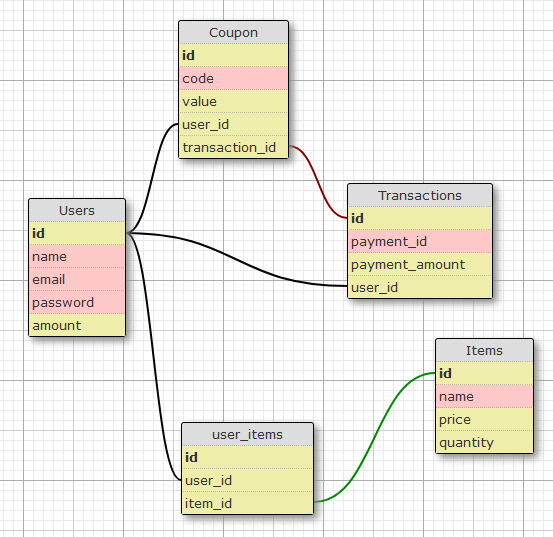

  

# Projeto Martech - Pagamento e criação de Vouchers/Cupons 🛍️

 Desenvolvida com Flask, essa aplicação permite que os usuários recebam um valor em reais na hora de se cadastrar. Após realizar o login, escolherem os produtos e realizarem o pagamento com o PayPal, os usuários ganham um voucher de desconto com o valor que não foi gasto e ele fica visível para quem acessar a API.

## Configuração 🔧

Antes de começar a usar o projeto, é preciso configurar as suas credenciais do PayPal. Siga os passos abaixo:

1. Crie uma conta no PayPal, se ainda não tiver uma.
2. Acesse o [painel de desenvolvedor do PayPal](https://developer.paypal.com/) e faça login.
3. Crie um aplicativo do PayPal Sandbox.
4. Copie o Client ID e o Client Secret do seu aplicativo e os cole no arquivo `.env.example`, substituindo os valores de exemplo.
5. Renomeie o arquivo .env.example para .env.

## Instalação 🚀

Requer o [Python 3](https://www.python.org/downloads/) instalado para rodar.

Para usar localmente, siga estes passos:

1. Clone o repositório para a sua máquina.
2. Crie um ambiente virtual executando `python3 -m venv venv` no terminal.
3. Ative o ambiente virtual executando `source venv/bin/activate`.
4. Instale as dependências necessárias executando `pip install -r requirements.txt`.
5. Inicie o servidor back-end executando `flask run` no terminal. Isso iniciará o servidor Flask, por exemplo, na porta `http://localhost:5000`.
6. Acesse a documentação da API navegando para `http://localhost:5000/` em seu navegador da web.
